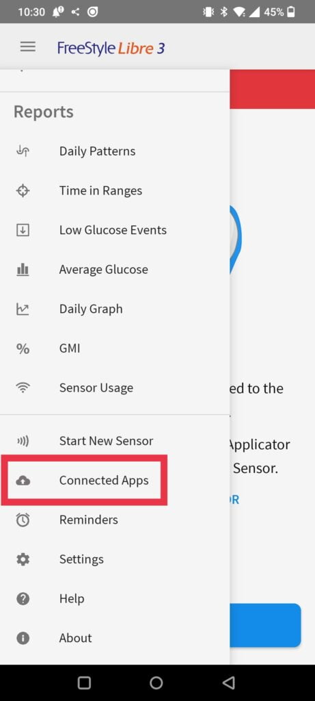
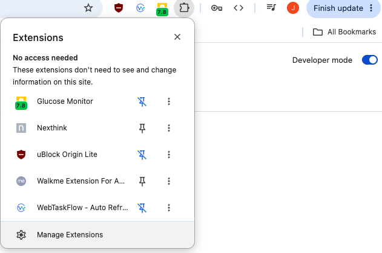
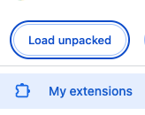
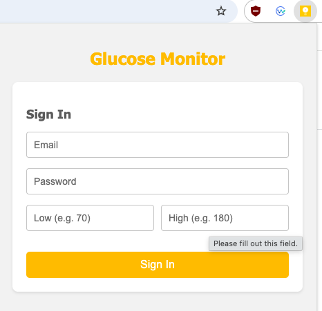
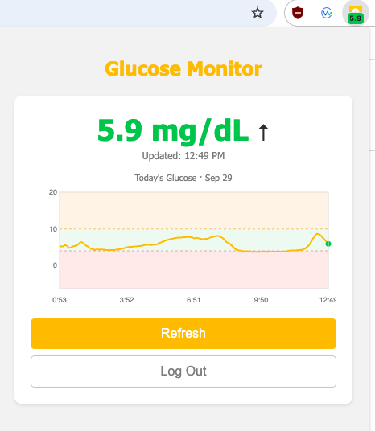
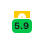

# Glucose Monitor

A Chrome extension that shows your current glucose level and today's glucose
trend in the toolbar, using the same LibreLinkUp API that the official
LibreLinkUp mobile app uses.

The point of it: you shouldn't have to pull out your phone and open an app
just to check a glucose reading. A glance at the browser toolbar you already
have open all day is enough.

This extension is a **follower** client: it does not talk to a FreeStyle
Libre sensor directly. It signs in as a LibreLinkUp follower and reads the
data that the sensor wearer has chosen to share, exactly like the LibreLinkUp
mobile app does.

## 1. Set up LibreLinkUp first

You need a LibreLinkUp follower account *before* this extension can show any
data. If you already use the LibreLinkUp mobile app to follow someone, skip
to [step 2](#2-connect-the-extension) and reuse those same credentials.

### If you are the person wearing the sensor

1. Open the **FreeStyle LibreLink** app on your phone.
2. Go to the navigation menu → **Connected Apps**.

   

3. Select **Connect** (or **Manage**) under **LibreLinkUp**.
4. Tap **Add Connection** and enter the follower's first name, surname, and
   email address, then tap **Add**.
5. The follower will receive an invitation email.

### If you are the follower (the account this extension signs in as)

1. Download the **LibreLinkUp** app ([App Store](https://apps.apple.com/app/librelinkup/id1032329181) /
   [Google Play](https://play.google.com/store/apps/details?id=com.freestylelibre.app.gb.followapp)) and open the invitation email.
2. Create a LibreView account (or sign in with an existing one) **using the
   same email address the wearer invited**. The account you create here —
   email + password — is what you'll enter into this extension.
3. Log in to the LibreLinkUp app and accept the pending connection.
4. Confirm you can see the sensor wearer's glucose reading in the app. Once
   that works, the same credentials will work in this extension.

Official reference: [LibreLinkUp FAQ](https://www.librelinkup.com/faqs) ·
[LibreLinkUp](https://www.librelinkup.com/)

> LibreLinkUp accounts are separate from the wearer's own LibreLink login —
> don't try to sign in with the wearer's credentials, only the follower's.

## 2. Connect the extension

1. Go to `chrome://extensions` and turn on **Developer mode** (top right).

   

2. Click **Load unpacked** and select this folder.

   

3. Click the extension icon and sign in with your LibreLinkUp **follower**
   email and password (the account from step 1) and set your low/high
   glucose thresholds.

   

4. The extension detects your account's region automatically on first sign
   in — there's nothing to configure there.

Once signed in, the popup shows the current value, trend arrow, and a chart
of today's glucose:

The toolbar badge updates every minute with the latest reading, colored
green/amber/red against your thresholds. Pin the extension (puzzle-piece icon
in the toolbar → pin) to keep the reading visible at all times:

### Signed in but seeing an error?

- **"Invalid email or password."** — double-check you're using the
  follower's LibreLinkUp login, not the wearer's, and that you can still log
  in to the LibreLinkUp app with the same credentials.
- **"Too many login attempts…"** — LibreView temporarily rate-limits repeated
  failed logins; wait for the time shown before retrying.
- **"No glucose data available for this account."** — you're logged in, but
  the wearer hasn't shared an active connection with this account yet (see
  step 1).
- Use **Log Out** in the popup to clear stored credentials and start over.

## Notes

- Credentials and the session token are kept in `chrome.storage.session`,
  which Chrome clears automatically when the browser closes.
- The auth/connection flow follows the reverse-engineered LibreLinkUp API
  documented in [this community gist](https://gist.github.com/khskekec/6c13ba01b10d3018d816706a32ae8ab2).
- This project is unaffiliated with Abbott, LibreLink, or LibreLinkUp.
